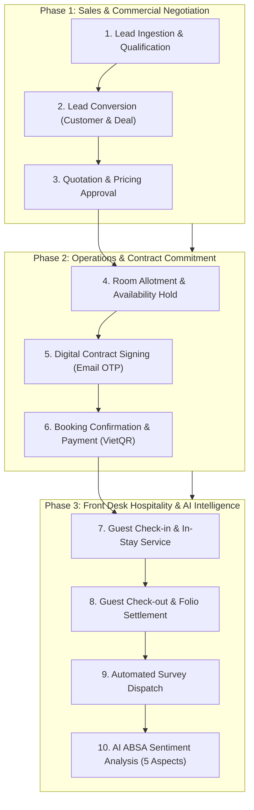

# Leadora

Leadora is an enterprise-grade Hospitality CRM system engineered for high-performance sales management and hotel operations. It features a modular monolith backend with Java 21 Virtual Threads, a modern Next.js web dashboard, and a feature-first Flutter mobile application.

---

## Workspace Layout

```text
leadora/
  backend/        Spring Boot 3.5 modular monolith (Java 21, Spring AI, PostgreSQL, Redis)
  frontend/       Next.js 15 web dashboard workspace (React 19, TypeScript, Tailwind CSS)
  mobile/         Flutter mobile sales application workspace (Riverpod, Dio, GoRouter)
  docs/           Architecture notes, demo scripts, and SRS documentation
```

---

## Tech Stack Overview

### Backend
- **Core Framework:** Spring Boot 3.5.x, Java 21 (Virtual Threads / Project Loom enabled)
- **Persistence & Caching:** Spring Data JPA, Hibernate 6, PostgreSQL 17 (with `pgvector`), Redis 8.2
- **Security & RBAC:** Spring Security, OAuth2/JWT (HS256 symmetric validation), Role-Based Access Control (`ADMIN`, `MANAGER`, `SALES`, `RESERVATION`)
- **AI & RAG Engine:** Spring AI 1.1.7, Google Cloud Vertex AI (Gemini 2.5 Flash, Google GenAI Embeddings), pgvector HNSW indexing, Apache Tika & Vision OCR
- **Performance & Messaging:** HikariCP connection pooling, Event-driven cache invalidation, Spring Application Events (`@Async` non-blocking execution)

### Frontend
- **Framework:** Next.js 15 (App Router), React 19, TypeScript
- **State & Data Fetching:** TanStack React Query v5, Zustand
- **UI & Styling:** Tailwind CSS, Radix UI, Lucide Icons

### Mobile
- **Framework:** Flutter 3.x (Dart 3)
- **State Management:** `flutter_riverpod` + `riverpod_generator`
- **Routing & Navigation:** `go_router`
- **Networking & Cache:** `dio` (with token refresh & cache interceptors)
- **Auth & Storage:** Biometric authentication (`local_auth`), `flutter_secure_storage`

---

## Complete End-to-End Business Workflow

Leadora orchestrates the complete hospitality CRM lifecycle across three integrated operational phases:



### Detailed Workflow Breakdown

| Step | Stage | Primary Actor | Action & Business Rules | Output / Entity State |
| :--- | :--- | :--- | :--- | :--- |
| **01** | **Lead Ingestion** | System / Marketing | Capture incoming inquiries; validate deduplication and assign to Sales rep. | `Lead (NEW)` |
| **02** | **Lead Conversion** | Sales Staff | Qualify requirements; convert Lead into verified business account and pipeline deal. | `Customer` + `Deal (OPEN)` |
| **03** | **Quotation & Pricing** | Sales Staff / Manager | Select room types, dates, and packages; auto-check discount approval thresholds. | `Quotation (APPROVED)` |
| **04** | **Room Allotment** | Reservation Desk | Verify real-time room availability matrix and place inventory allocation hold. | `Allotment Hold` |
| **05** | **Digital Contract** | Customer / System | Generate PDF contract with terms; customer verifies and signs via secure email OTP. | `Contract (ACTIVE)` |
| **06** | **Booking & Payment** | Customer / System | Issue booking order; reconcile banking transactions automatically via VietQR / SePay. | `Booking (PAID)` |
| **07** | **Guest Check-in** | Front Desk | Verify customer identity, assign physical room numbers, and manage guest arrival. | `Reservation (CHECKED_IN)` |
| **08** | **Guest Check-out** | Front Desk | Settle incidental folios, finalize guest departure, and release room inventory for housekeeping. | `Reservation (CHECKED_OUT)` |
| **09** | **Feedback Survey** | Guest | System issues secure survey invitation; guest submits satisfaction ratings and comments. | `Feedback (SUBMITTED)` |
| **10** | **AI ABSA Analysis** | AI Engine (NLP) | Asynchronously evaluate 5 key hotel aspects: Attitude, Speed, Accuracy, Facility, Price. | `ABSA Sentiment Badges` |

---

## Getting Started

### Prerequisites

Make sure you have the following installed locally:
- **Java JDK 21** or higher
- **Node.js** (v18+) and **npm / pnpm**
- **Flutter SDK** (v3.x)
- **Docker Desktop** (for PostgreSQL pgvector & Redis)
- **Google Cloud SDK** (for Google Vertex AI authentication)

### Environment Configuration

Configure your environment variables by creating a `.env` file at the root of the workspace (`leadora/.env`). Both backend and frontend read from this file.

```properties
# Database Configuration (PostgreSQL with pgvector)
SPRING_DATASOURCE_URL=jdbc:postgresql://localhost:5432/mydatabase
SPRING_DATASOURCE_USERNAME=your_db_username
SPRING_DATASOURCE_PASSWORD=your_db_password

# Redis Configuration (Caching & Session Management)
REDIS_URL=redis://localhost:6379

# Google Vertex AI Configuration (Internal Sales Chat Assistant & RAG)
GEMINI_USE_VERTEX=true
GEMINI_PROJECT_ID=your-gcp-project-id
GEMINI_LOCATION=asia-southeast1
GEMINI_CHAT_MODEL=gemini-2.5-flash
GEMINI_EMBEDDING_MODEL=gemini-embedding-001
AI_EMBEDDING_DIMENSIONS=768
AI_VECTORSTORE_INIT_SCHEMA=true
AI_SEMANTIC_CHUNKING=true
AI_CHAT_DEV_USER_ID=

# Supabase Storage & JWT (Optional / Cloud Storage adapter)
SUPABASE_URL=https://your-project.supabase.co
SUPABASE_JWT_SECRET=your_jwt_secret
SUPABASE_SERVICE_ROLE_KEY=your_service_role_key

# Email Infrastructure (Resend API)
RESEND_API_KEY=your_resend_api_key
RESEND_FROM_EMAIL=noreply@yourdomain.com

# ABSA Engine Configuration (Aspect-Based Sentiment Analysis)
ABSA_ENGINE_URL=https://your-absa-engine-url.run.app
```

Authenticate with Google Cloud Vertex AI on your local machine:
```bash
gcloud auth application-default login
```

---

## Running the Services

### 1. External Infrastructure (Docker Compose)
Start the PostgreSQL pgvector database and Redis cache:
```bash
cd backend
docker compose up -d
```

### 2. Backend Application (Spring Boot)
Run the Spring Boot backend server:
```bash
cd backend
# Linux / macOS:
./mvnw spring-boot:run
# Windows:
.\mvnw.cmd spring-boot:run
```
* The REST API will be available at: `http://localhost:8085`
* Run backend automated test suites:
  ```bash
  ./mvnw test
  ```

### 3. Frontend Web Dashboard (Next.js)
Run the Next.js development server:
```bash
cd frontend
npm install
npm run dev
```
* The web client dashboard will be available at: `http://localhost:3000`

### 4. Mobile Application (Flutter)
Install dependencies and run the mobile client:
```bash
cd mobile
flutter pub get
dart run build_runner build -d
flutter run --dart-define-from-file=config/dev.json
```

---

## AI & Intelligent Features

### 1. Internal Sales Chat Assistant (Lia)
- **Architecture:** Spring AI + Google Vertex AI Gemini 2.5 Flash with **Server-Sent Events (SSE)** token streaming.
- **Security & Guardrails:** Rule-based zero-token guardrails (`IntentClassifier`) intercepting unauthorized mutations and enforcing data scoping.
- **RAG Knowledge Base:** Automated document ingestion (PDF, Word, TXT) with Apache Tika text layer extraction, Vision OCR for charts/images, Semantic Chunking, and cosine distance search over pgvector.
- **Short Transaction Architecture:** Detached DTO snapshots prevent connection pool starvation during long LLM generative responses.

### 2. Aspect-Based Sentiment Analysis (ABSA)
- Analyzes post-checkout guest feedback across 5 critical hotel aspects: **Attitude**, **Speed**, **Accuracy**, **Facility**, and **Price**.
- Executed asynchronously via event listeners without blocking customer checkout flow.