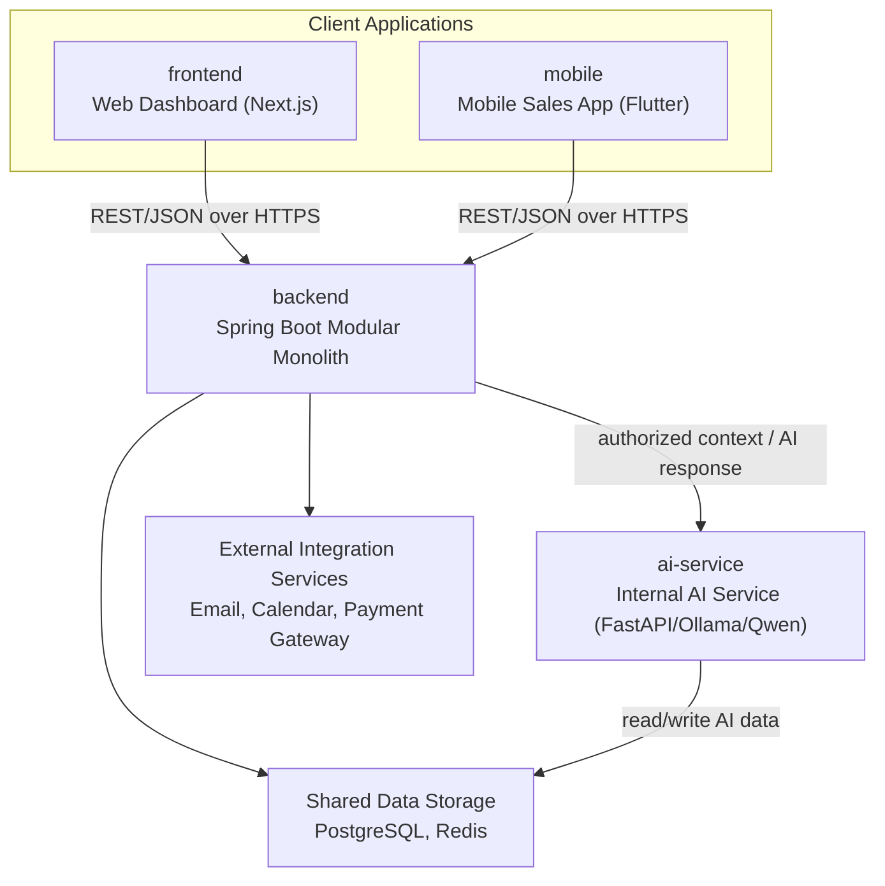
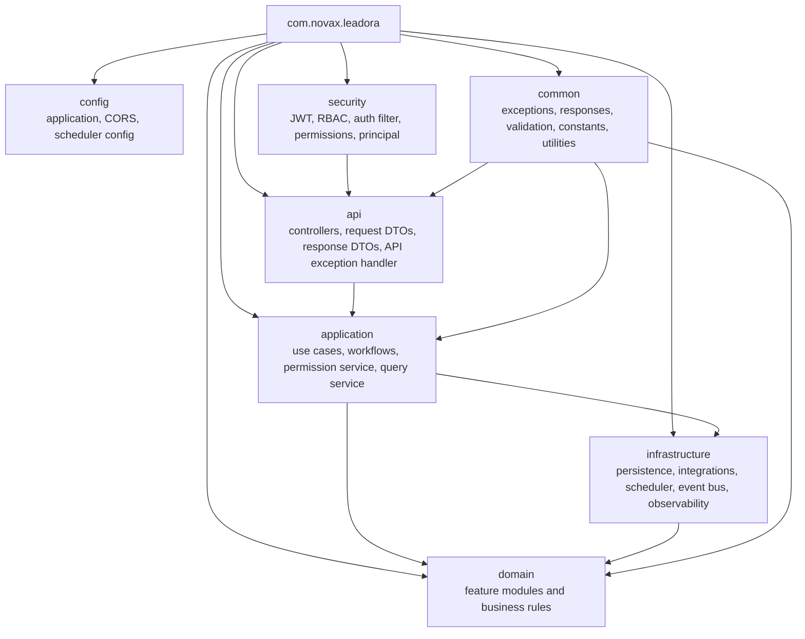
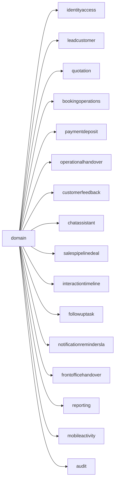
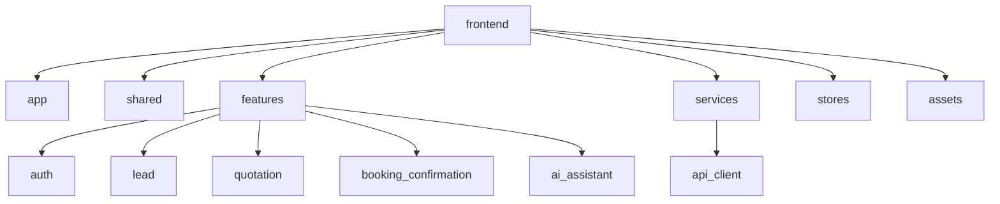
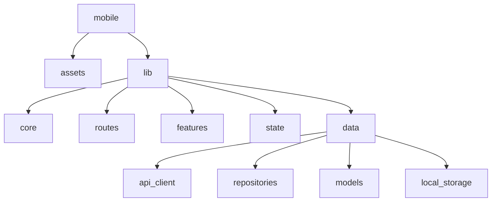
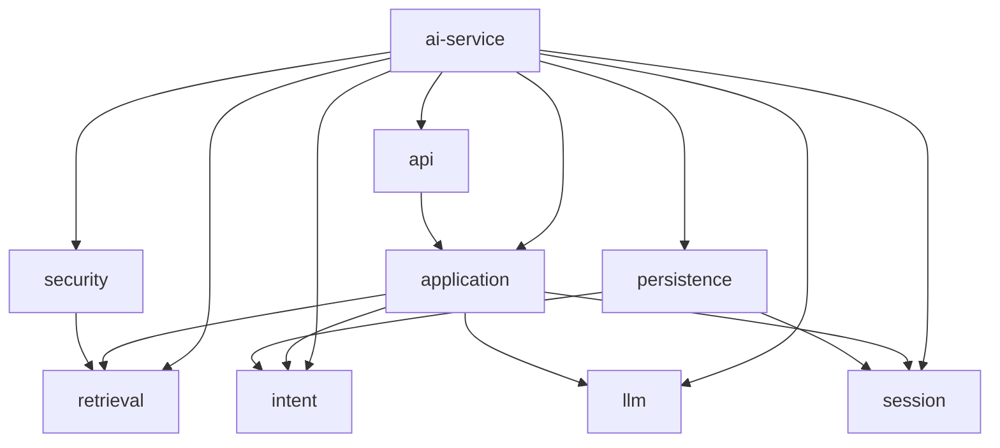

# Leadora Package Diagrams

This document records the intended workspace and package boundaries used for coding iterations.

## System Workspace

## Backend Package Diagram

## Backend Domain Modules

## Frontend Package Target

## Mobile Package Target

## AI Service Package Target

