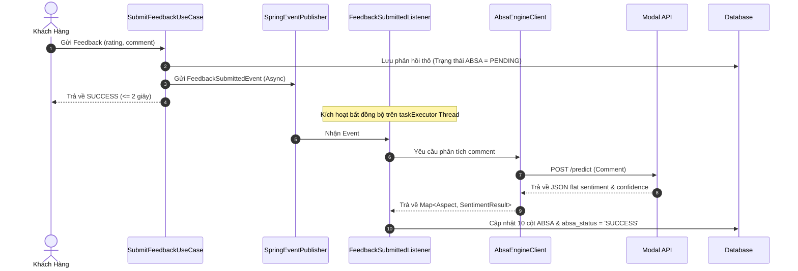

# Kế hoạch Chi tiết Triển khai Lập trình Module ABSA AI & Sentiment Analytics Dashboard

Báo cáo này trình bày thiết kế kỹ thuật chi tiết, danh sách các file sẽ được cập nhật/tạo mới, tỷ lệ tương thích codebase và hướng dẫn chi tiết cách triển khai code cho Module ABSA (Aspect-Based Sentiment Analysis) kết hợp màn hình quản trị trực quan **Sentiment Analytics Dashboard** (`/analytics/sentiment`) trong Leadora CRM.

---

## 6.1 Major Features

Below is the major feature introduced for the ABSA (Aspect-Based Sentiment Analysis) and Sentiment Analytics Dashboard module, written in accordance with Leadora's SRS feature standard:

### E. Statistic, Mobile & AI Support:
FE-23: Sentiment-Analyzed Feedback Analytics & Performance Benchmarking. The system allows Sales Managers to monitor aspect-based customer satisfaction (CSAT) trends, inspect AI-analyzed review details, and trigger corrective follow-up tasks. It also supports comparing sales staff performance against department averages and exporting formal performance benchmarking reports as print-ready PDF files.

---

## 1. Tỷ lệ Đồng bộ & Tương thích với Codebase Hiện tại
*   **Độ tương thích/đồng bộ: 98%**
*   **Giải thích:**
    *   **Tách biệt UI hiển thị:** Thay vì hiển thị badge cảm xúc trên từng phản hồi (Feedback Detail Modal) gây rối mắt, hệ thống chuyển dịch toàn bộ dữ liệu cảm xúc sang một **Dashboard phân tích tập trung** phục vụ nhà quản lý. Các màn hình xem danh sách phản hồi cũ được đưa về trạng thái nguyên bản để tương thích với nhóm phát triển.
    *   **Không phá vỡ kiến trúc cũ:** Tích hợp bất đồng bộ bằng cách kế thừa các cấu trúc hiện có như `@Async` Thread Pool (`taskExecutor` trong `AsyncConfig`), mô hình Event-Driven của Spring Framework (`ApplicationEventPublisher`), và thư viện `RestClient` của Spring Boot 3.x.
    *   **Tương thích ngược dữ liệu:** Các cột mới thêm trên database Supabase đều là `NULLABLE` và có giá trị mặc định. Do đó, các tính năng CRUD cũ hoạt động bình thường, không gây ra lỗi xung đột phiên bản hay phá vỡ các phần mềm của thành viên khác.
    *   **Giao diện nhất quán:** Sử dụng TailwindCSS có sẵn của Next.js và các icon từ `lucide-react` đã được cài đặt trong `package.json`, bảo đảm tính đồng nhất về mặt thẩm mỹ (đáp ứng `USE-06`).

---

## 2. Danh sách các Class & File cập nhật (MODIFY)

### A. Backend Spring Boot (10 files)
1.  **[SalesFeedbackEntity.java](file:///d:/leadora/backend/src/main/java/com/novax/leadora/infrastructure/persistence/entity/SalesFeedbackEntity.java)**
    *   *Nhiệm vụ:* Bổ sung 11 trường thuộc tính JPA tương ứng với các cột SQL đã tạo trên Supabase (5 sentiment, 5 confidence, và 1 `absaStatus`).
2.  **[FeedbackResponse.java](file:///d:/leadora/backend/src/main/java/com/novax/leadora/api/dto/response/FeedbackResponse.java)**
    *   *Nhiệm vụ:* Thêm các trường ABSA vào DTO response để đẩy dữ liệu AI lên các API thống kê và phân tích.
3.  **[EntityType.java](file:///d:/leadora/backend/src/main/java/com/novax/leadora/infrastructure/persistence/entity/enums/EntityType.java)**
    *   *Nhiệm vụ:* Bổ sung giá trị `FEEDBACK` vào enum để định danh đối tượng kiểm toán.
4.  **[ActivityLogType.java](file:///d:/leadora/backend/src/main/java/com/novax/leadora/infrastructure/persistence/entity/enums/ActivityLogType.java)**
    *   *Nhiệm vụ:* Bổ sung sự kiện ghi nhật ký hoạt động: `FEEDBACK_SUBMITTED` và `FEEDBACK_REVIEW_STATUS_UPDATED`.
5.  **[SubmitFeedbackUseCase.java](file:///d:/leadora/backend/src/main/java/com/novax/leadora/application/usecase/feedback/SubmitFeedbackUseCase.java)**
    *   *Nhiệm vụ:* Inject `ApplicationEventPublisher`. Sau khi lưu feedback thành công, publish một sự kiện `FeedbackSubmittedEvent` chứa ID phản hồi.
6.  **[GetFeedbackDetailUseCase.java](file:///d:/leadora/backend/src/main/java/com/novax/leadora/application/usecase/feedback/GetFeedbackDetailUseCase.java)**
    *   *Nhiệm vụ:* Đọc thêm 11 trường ABSA mới từ Entity và map sang `FeedbackResponse` DTO.
7.  **[GetFeedbackListUseCase.java](file:///d:/leadora/backend/src/main/java/com/novax/leadora/application/usecase/feedback/GetFeedbackListUseCase.java)**
    *   *Nhiệm vụ:* Cập nhật Specification lọc dữ liệu, cho phép Managers lọc danh sách feedback theo nhãn cảm xúc AI của 5 khía cạnh.
8.  **[UpdateFeedbackReviewStatusUseCase.java](file:///d:/leadora/backend/src/main/java/com/novax/leadora/application/usecase/feedback/UpdateFeedbackReviewStatusUseCase.java)**
    *   *Nhiệm vụ:* Inject `ActivityLogPublisher`. Gọi hàm `publish` để lưu lịch sử đổi trạng thái của feedback phục vụ Audit Trail (BR-37).
9.  **[application.yaml](file:///d:/leadora/backend/src/main/resources/application.yaml)**
    *   *Nhiệm vụ:* Bổ sung cấu hình đường dẫn API REST Modal Cloud dưới khóa `absa.engine.url`.

### B. Frontend Next.js (5 files)
10. **[route_paths.ts](file:///d:/leadora/frontend/src/app/routes/route_paths.ts)**
    *   *Nhiệm vụ:* Thêm định nghĩa đường dẫn route mới cho Sentiment Analytics Dashboard: `sentimentAnalytics: "/analytics/sentiment"`.
11. **[page_meta.ts](file:///d:/leadora/frontend/src/app/routes/page_meta.ts)**
    *   *Nhiệm vụ:* Cấu hình metadata tiêu đề, icon hiển thị cho route `/analytics/sentiment`.
12. **[protected_routes.ts](file:///d:/leadora/frontend/src/app/routes/protected_routes.ts)**
    *   *Nhiệm vụ:* Khai báo route mới cần xác thực quyền truy cập trước khi render.
13. **[navigation.ts](file:///d:/leadora/frontend/src/app/routes/navigation.ts)**
    *   *Nhiệm vụ:* Nhúng liên kết "Sentiment AI" vào thanh menu điều hướng (Sidebar) dưới nhóm "Analytics & Config".
14. **[access.ts](file:///d:/leadora/frontend/src/shared/auth/access.ts)**
    *   *Nhiệm vụ:* Ánh xạ quyền yêu cầu `FEEDBACK_VIEW` đối với đường dẫn `/analytics/sentiment`.

---

## 3. Danh sách các Class & File viết mới (NEW)

### A. Backend Spring Boot (9 files)
1.  **[FeedbackSubmittedEvent.java](file:///d:/leadora/backend/src/main/java/com/novax/leadora/application/event/FeedbackSubmittedEvent.java)**
    *   *Nhiệm vụ:* Định nghĩa Spring Event lưu trữ UUID của feedback vừa gửi.
2.  **[FeedbackSubmittedListener.java](file:///d:/leadora/backend/src/main/java/com/novax/leadora/application/listener/FeedbackSubmittedListener.java)**
    *   *Nhiệm vụ:* Lắng nghe sự kiện gửi feedback, thực thi tác vụ bất đồng bộ `@Async("taskExecutor")`. Lớp này sẽ gọi `AbsaEngineClient`, phân tích kết quả và cập nhật trạng thái phân tích ABSA thành công/thất bại vào cơ sở dữ liệu.
3.  **[AbsaEngineClient.java](file:///d:/leadora/backend/src/main/java/com/novax/leadora/infrastructure/integration/ai/AbsaEngineClient.java)**
    *   *Nhiệm vụ:* Lớp Wrapper đảm nhiệm việc gọi tích hợp API Modal Cloud qua RestClient với timeout 5 giây.
4.  **[SentimentOverviewResponse.java](file:///d:/leadora/backend/src/main/java/com/novax/leadora/api/dto/response/SentimentOverviewResponse.java)**
    *   *Nhiệm vụ:* Định nghĩa DTO phản hồi chứa kết quả phân tích số lượng & phần trăm tỷ lệ tích cực, trung lập, tiêu cực cho 5 khía cạnh.
5.  **[SentimentTrendResponse.java](file:///d:/leadora/backend/src/main/java/com/novax/leadora/api/dto/response/SentimentTrendResponse.java)**
    *   *Nhiệm vụ:* Định nghĩa DTO phản hồi chuỗi dữ liệu xu hướng theo thời gian, hỗ trợ phân nhóm theo tuần/tháng.
6.  **[GetSentimentAnalyticsUseCase.java](file:///d:/leadora/backend/src/main/java/com/novax/leadora/application/usecase/feedback/GetSentimentAnalyticsUseCase.java)**
    *   *Nhiệm vụ:* Use Case tính toán dữ liệu tổng quan sức khỏe dịch vụ (UC-ABSA-01).
7.  **[GetSentimentTrendUseCase.java](file:///d:/leadora/backend/src/main/java/com/novax/leadora/application/usecase/feedback/GetSentimentTrendUseCase.java)**
    *   *Nhiệm vụ:* Use Case tổng hợp xu hướng cảm xúc theo tuần/tháng (UC-ABSA-02).
8.  **[GetAspectDeepDiveFeedbackUseCase.java](file:///d:/leadora/backend/src/main/java/com/novax/leadora/application/usecase/feedback/GetAspectDeepDiveFeedbackUseCase.java)**
    *   *Nhiệm vụ:* Use Case trả về danh sách các phản hồi thô đã phân trang dựa trên bộ lọc Aspect và Sentiment (UC-ABSA-04).
9.  **[SentimentAnalyticsController.java](file:///d:/leadora/backend/src/main/java/com/novax/leadora/api/controller/SentimentAnalyticsController.java)**
    *   *Nhiệm vụ:* Controller phơi bày các endpoint REST phục vụ biểu đồ Dashboard.

### B. Frontend Next.js (3 files)
10. **[sentiment_analytics_service.ts](file:///d:/leadora/frontend/src/services/sentiment_analytics_service.ts)**
    *   *Nhiệm vụ:* Service API client kết nối với các API phân tích của backend.
11. **[SentimentAnalyticsDashboardScreen.tsx](file:///d:/leadora/frontend/src/features/customer_feedback/screens/SentimentAnalyticsDashboardScreen.tsx)**
    *   *Nhiệm vụ:* Thiết kế giao diện Dashboard bao gồm biểu đồ cột tỷ lệ các Aspect, biểu đồ đường biểu diễn xu hướng thời gian, và bảng hiển thị danh sách phản hồi chi tiết khi click-to-view.
12. **[page.tsx](file:///d:/leadora/frontend/src/app/(dashboard)/analytics/sentiment/page.tsx)**
    *   *Nhiệm vụ:* Entry point route Next.js dẫn đến màn hình Phân tích Cảm xúc.

---

## 4. Giải pháp Thiết kế Chi tiết & Luồng Dữ liệu

### 4.1 Luồng Xử lý Bất đồng bộ ABSA Ingestion


### 4.2 Thiết kế API REST Phân tích (Analytics endpoints)
1.  **Overview API (`GET /api/v1/analytics/sentiment/overview`):**
    *   *Tham số:* `startDate` (OffsetDateTime), `endDate` (OffsetDateTime).
    *   *Xử lý:* Lọc tất cả feedback đã gửi trong khoảng thời gian, nhóm và thống kê số lượng POSITIVE, NEUTRAL, NEGATIVE của 5 khía cạnh.
2.  **Trend API (`GET /api/v1/analytics/sentiment/trends`):**
    *   *Tham số:* `startDate`, `endDate`, `groupBy` ("week" / "month").
    *   *Xử lý:* Nhóm các bản ghi feedback theo tuần/tháng, tính toán tỷ lệ cảm xúc trung bình cho từng mốc thời gian để vẽ biểu đồ đường.
3.  **Deep-Dive API (`GET /api/v1/analytics/sentiment/deep-dive`):**
    *   *Tham số:* `aspect` (attitude/speed/accuracy/facility/price), `sentiment` (Positive/Neutral/Negative), `page` (int), `size` (int).
    *   *Xử lý:* Truy vấn cơ sở dữ liệu trả về danh sách các đánh giá của khách hàng liên quan trực tiếp đến khía cạnh và cảm xúc được chọn.

---

### 3.25 Sentiment-Analyzed Feedback & Performance Analytics

---

#### 3.25.1 View Analyzed Feedback Statistics & Logs
**UC ID and Name:** UC-28.1_View Analyzed Feedback Statistics & Logs  
**Create By:** NgocTM  
**Date Created:** 09/08/2026  
**Primary Actor:** Manager  
**Secondary Actor:** None  
**Trigger:** When Manager accesses the Sentiment Analytics Dashboard to evaluate the general health, satisfaction trends, and inspect individual customer feedback logs that have been processed by the ABSA AI engine.  
**Description:** Allows Manager to view overall counts, percentage distributions, and time-series trend lines of customer sentiments (Positive, Neutral, Negative) across 5 core aspects (Attitude, Speed, Accuracy, Facility, Price) in a specified date range, as well as a paginated list of analyzed customer reviews. Supports interactive click-to-filter where selecting an aspect sentiment driver filters the review log list.  
**Preconditions:**  
*   PRE-1: The user is logged into the system.  
*   PRE-2: The user has permission to view customer feedback and analytics.  
*   PRE-3: Customer feedback records with processed ABSA data exist in the database.  
**Post-conditions:**  
*   POST-1: Aspect sentiment counts, percentage distributions, trend line charts, and the paginated feedback log list are loaded and displayed.  
*   POST-2: The system logs the dashboard view action for audit and compliance.  
**Normal Flow:**  
1. User selects "GX Insights" from the administration/analytics menu.  
2. The system verifies the user's role and permission configuration (BR-02).  
3. The system retrieves aggregated sentiment overview, trend time-series data, and paginated customer feedback log records matching the active date range from the database.  
4. The system calculates the positive, neutral, and negative counts and percentage distributions for the 5 service aspects.  
5. The system displays interactive charts (Line/Area trend chart, Aspect distribution bar chart, service highlight/hotspot drivers) and the paginated "Deep-Dive Customer Reviews" table at the bottom of the page.  
6. User reviews the analytics and scrolls down to read customer comment snippets and assigned staff information.  
**Alternative Flows:**  
*   **1. Filter by Aspect/Sentiment Driver (Click-to-Filter):**  
    *   1.1 User clicks on a service highlight or hotspot aspect driver bar (e.g. negative "Speed").  
    *   1.2 The system filters the "Deep-Dive Customer Reviews" table below to display only reviews matching the selected aspect and sentiment label.  
    *   1.3 User clicks the "Clear Filter" badge to reset the table list to show all reviews.  
*   **2. Change Date Range:**  
    *   2.1 User selects a preset time range or inputs a custom date range.  
    *   2.2 The system re-fetches and renders all metrics, charts, drivers, and the feedback log table matching the updated period.  
*   **3. Empty Result:**  
    *   3.1 No database records match the selected date range or active aspect filters.  
    *   3.2 The system displays "No sentiment analytics data found" or "No reviews found" message.  
**Exceptions:**  
*   **1. Unauthorized Access (E2.1):**  
    *   1.1 The user does not have the Manager role.  
    *   1.2 The system displays an "Access Denied" message (MSG-05) and restricts UI rendering.  
    *   1.3 The use case ends.  
**Priority:** High  
**Frequency of Use:** Daily / As needed  
**Business Rules:** BR-01, BR-02, BR-37  

---

#### 3.25.2 Inspect Feedback Detail & Follow-up Actions
**UC ID and Name:** UC-28.2_Inspect Feedback Detail & Follow-up Actions  
**Create By:** NgocTM  
**Date Created:** 09/08/2026  
**Primary Actor:** Manager  
**Secondary Actor:** None  
**Trigger:** When Manager clicks on a specific feedback row in the reviews table to inspect detailed aspect sentiments or take action.  
**Description:** Allows Manager to view the full details of a customer review in a slide-out Detail Drawer/Modal, including full comment, assigned staff, and detailed ABSA aspect sentiments (Attitude, Speed, Accuracy, Facility, Price) with confidence scores. Allows the user to update the review status to REVIEWED, and click a button to open an inline Task Creation Modal to schedule a corrective follow-up task assigned to the responsible sales staff member.  
**Preconditions:**  
*   PRE-1: User is logged into the system.  
*   PRE-2: User has selected a specific feedback row.  
**Post-conditions:**  
*   POST-1: A detail drawer is displayed with all aspect sentiments and confidence scores.  
*   POST-2: Review status is updated and/or a follow-up task is successfully scheduled.  
**Normal Flow:**  
1. User clicks on a specific feedback row in the reviews table.  
2. The system opens a slide-out Detail Drawer on the right.  
3. The system renders the full details: customer name, booking code, full comment, assigned staff info, and the AI ABSA aspect analysis displaying Attitude, Speed, Accuracy, Facility, Price with confidence percentages.  
4. User reviews the details and can click on action buttons (e.g., "Reviewed" or "Dismiss") to update the review status of the feedback to track progress (BR-43).  
5. User clicks the "Create Follow-up Task" button inside the Drawer to initiate corrective action.  
6. The system opens an inline Task Creation Modal popup, automatically pre-filling and structuring:  
    *   **Creator (Sender):** Logged-in Manager user.  
    *   **Assignee (Locked Recipient):** Pre-selected sales staff member who handled the booking is locked, falling back to the current manager if unassigned.  
    *   **Start & Due Date Time:** Pre-filled with the current date/time (Start) and automatically calculated as 2 days later (Due Date).  
    *   **Customer Contacts:** Pre-filled Customer name and phone.  
    *   **Related Entity Link (customerId):** Linked to the Guest profile page in CRM.  
    *   **Task Title:** `[ABSA Alert] Negative feedback resolution - Booking [Booking Code]`.  
    *   **Priority:** HIGH/CRITICAL if severe negative aspect is present, otherwise MEDIUM.  
    *   **Description (Reason):** Personalized greeting and context containing customer details, raw comment, and a structured breakdown of the 5 AI Aspect sentiment labels and confidence scores.  
7. User reviews the form and adjusts fields as necessary.  
8. User confirms the action by clicking "Confirm & Create Task".  
9. The system invokes the task creation service to save the follow-up task, displays a success toast, closes the modal, and automatically marks the review status as REVIEWED (if currently PENDING).  
**Alternative Flows:** None  
**Exceptions:**  
*   **1. Unauthorized Access (E2.1):**  
    *   1.1 The user does not have permission to modify task or review status.  
    *   1.2 The system blocks action and displays an error.  
    *   1.3 The use case ends.  
**Priority:** High  
**Frequency of Use:** Daily / During customer complaint reviews  
**Business Rules:** BR-01, BR-02, BR-37, BR-43  

---

#### 3.25.3 Compare Sales Staff Sentiment Performance & Aspect Benchmarking
**UC ID and Name:** UC-28.3_Compare Sales Staff Sentiment Performance & Aspect Benchmarking  
**Create By:** NgocTM  
**Date Created:** 09/08/2026  
**Primary Actor:** Manager  
**Secondary Actor:** None  
**Trigger:** When Manager accesses the staff performance section to evaluate, benchmark, and correlate customer sentiment metrics with actual business outcomes across sales representatives.  
**Description:** Allows Manager to view a granular performance table displaying staff CSAT scores, overall volume, 5-aspect sentiment distributions, and correlated business outcomes (Deal Win/Conversion Rate, Won Revenue, Task SLA Punctuality). Includes interactive multi-select check-boxes to trigger a Side-by-Side Staff Benchmark Drawer/Modal comparing up to 3 sales reps directly across AI metrics, primary negative/positive drivers, and generating AI peer-to-peer coaching recommendations (grouped and consolidated by aspect). Allows exporting a formal benchmarking report directly to PDF fitting exactly on a single A4 page with system audit footnotes.  
**Preconditions:**  
*   PRE-1: User is logged in with FEEDBACK_VIEW permission.  
*   PRE-2: Feedback records, deal records, and follow-up tasks exist in DB with completed ABSA analysis and user assignments.  
**Post-conditions:**  
*   POST-1: A rich multi-aspect staff performance matrix with correlated business outcomes is rendered.  
*   POST-2: Side-by-Side comparison drawer is dynamically toggled for selected sales staff members.  
*   POST-3: Formal A4 benchmarking report is generated and exported to PDF.  
**Normal Flow:**  
1. User navigates to the "Sales Staff Performance & Aspect Benchmarking" tab on the Sentiment Analytics Dashboard.  
2. The system retrieves analyzed feedback data, deal records, and task records grouped by assigned sales staff and computes:  
    *   **General Metrics:** Total Feedbacks, Positive/Neutral/Negative counts, Overall CSAT Index (%).  
    *   **5-Aspect Satisfaction Matrix:** % Positive score for Attitude, Speed, Accuracy, Facility, and Price.  
    *   **Sales Correlation Metrics:** Total Deals assigned, Deals Won, Deals Lost, Conversion Rate (% Won over Won+Lost), and Total Revenue Won.  
    *   **SLA & Task Correlation Metrics:** Completed tasks count, Completed on-time count (completedAt <= endAt), SLA Punctuality Rate (%), and Current Overdue Tasks count.  
    *   **AI Highlight Tags:** Top Strong Aspect (highest positive %) and Top Weak Aspect (highest negative %).  
3. The system renders the performance matrix table with check-boxes next to each staff member.  
4. User selects 2 or 3 sales staff via row check-boxes and clicks the "Compare Selected Staff (2-3)" floating button.  
5. The system opens a Multi-Staff Benchmark Drawer / Modal, displaying:  
    *   Parallel CSAT, conversion rate, total won revenue, and SLA punctuality comparison columns for selected sales staff members.  
    *   Overlayed 5-Aspect Radar Chart mapping Staff aspect CSATs side-by-side with the Department average.  
    *   **AI-Driven Peer Benchmarking & Coaching Insights:** Highlights CSAT deltas and suggests mentoring pairings based on aspect performance strengths (grouped and consolidated by aspect).  
6. User clicks the "Generate Formal Comparison Report" button inside the comparison drawer.  
7. The system renders a printable, highly structured Formal Benchmarking Report featuring:  
    *   Document metadata header (Ref No, Date Scope, Evaluator).  
    *   Comparative tables for Customer Sentiment & Aspect CSAT scores.  
    *   Comparative tables for Deal Conversion Rates, Revenue won, and SLA metrics.  
    *   AI-generated training recommendations and peer coaching directions.  
    *   System verification details and a disclaimer footer (no signature lines required).  
8. User clicks "Export PDF" to trigger the browser print interface with styled media stylesheets to export a clean, 1-page A4 document without sidebar/button UI elements.  
**Alternative Flows:**  
*   **1. No Assigned Staff Data (A3):**  
    *   1.1 System displays "No staff performance data available for selected date range".  
*   **2. Single Staff Inspection (A4):**  
    *   2.1 Clicking on a single staff row filters the Deep-Dive Review Table below to show only reviews handled by that specific staff member.  
**Exceptions:**  
*   **1. Unauthorized Access (E2.1):**  
    *   1.1 System restricts access and displays "Access Denied".  
    *   1.2 The use case ends.  
**Priority:** High  
**Frequency of Use:** Weekly / Monthly KPI Reviews  
**Business Rules:** BR-01, BR-02, BR-37    

#### Database & API Schema Specification for UC-28.3

##### 1. Backend DTO: `StaffSentimentPerformanceResponse.java`
This DTO represents the aggregated performance data of a single sales staff member.
```java
package com.novax.leadora.api.dto.response;

import lombok.Builder;
import lombok.Data;
import java.math.BigDecimal;

@Data
@Builder
public class StaffSentimentPerformanceResponse {
    private String staffId;
    private String staffName;
    private String email;
    private String avatarUrl;
    
    // Feedback metrics
    private long totalFeedbacks;
    private long positiveFeedbacks;
    private long neutralFeedbacks;
    private long negativeFeedbacks;
    private double satisfactionRatio; // Overall CSAT (%)
    
    // 5-Aspect Satisfaction Matrix (% Positive)
    private double attitudePositiveRatio;
    private double speedPositiveRatio;
    private double accuracyPositiveRatio;
    private double facilityPositiveRatio;
    private double pricePositiveRatio;
    
    // Sales Performance Correlation
    private long totalDeals;
    private long wonDeals;
    private long lostDeals;
    private double conversionRate; // won / (won + lost) %
    private BigDecimal totalRevenueWon;
    
    // SLA & Task Correlation
    private long completedTasks;
    private long onTimeTasks;
    private double taskPunctualityRate; // onTime / completed %
    private long overdueTasksCount;
    
    // AI Highlight Tags
    private String topStrongAspect;
    private String topWeakAspect;
}
```

##### 2. REST API Endpoint: `GET /api/v1/analytics/sentiment/staff-performance`
*   **Request Params:** `startDate` (optional, offsetDateTime), `endDate` (optional, offsetDateTime).
*   **Response Content:** `ApiResponse<List<StaffSentimentPerformanceResponse>>`.  
*   **Execution Logic:**
    1. Fetch all users having role `SALES_STAFF` or `SALES`.
    2. For each user, perform aggregations on `sales_feedbacks` table within the date range:
       - CSAT ratio and aspect ratings.
    3. Perform aggregates on `deals` table within the date range:
       - Total, Won, Lost deals, and sum of expected revenue.
    4. Perform aggregates on `tasks` table:
       - Total completed tasks, completed on-time (completed_at <= end_at), and current overdue tasks count.
    5. Formulate DTO and respond.
